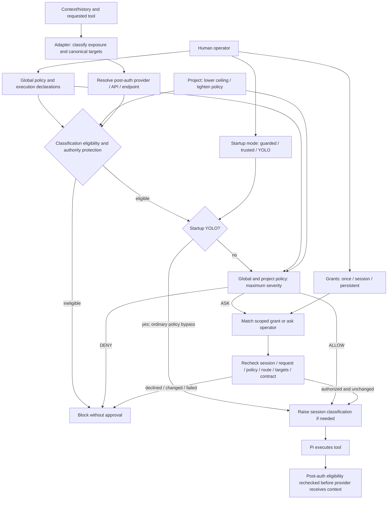

# Architecture

Tool policy governs model-requested invocation. It does not sandbox trusted
extension JavaScript. Installing an extension still requires source/package
review. An extension can execute independently of its model-facing tools.

## Modules

| Module | Responsibility |
|---|---|
| `eligibility.ts` | Strict classification declarations and pure context-release eligibility |
| `pi-runtime.ts` | Version-pinned post-authentication, pre-provider request veto |
| `runtime-broker.ts` | Versioned read-only classification and route-eligibility seam for trusted controllers |
| `index.ts` | Pi hooks, startup mode, session snapshots, serialized approvals, grant application, receipts/status |
| `config.ts` | Strict JSON, scope anchoring, canonical policy loading and freezing |
| `requests.ts` | Native shape validation and explicit target operations |
| `custom-tools.ts` | Small explicit reviewed registry, recall classification, unknown JSON validation and contract fingerprints |
| `grants.ts` | Stable identities and bounded owner-only mutable grant storage |
| `paths.ts` | Lexical/canonical identities, prospective destinations and readable-file checks |
| `policy.ts` | Pure restriction evaluation and maximum composition |
| `bash.ts` | Bounded literal command classification |
| `inspection.ts` | Target/subtree preflight for recognized Bash inspection |

Runtime imports are Node standard-library and relative modules; Pi type imports
are erased. No runtime dependency, tool replacement, argument rewrite, active-tool
reconstruction or general adapter plugin framework is introduced.

## Policy, grants and mode

Eligibility is evaluated first using `PUBLIC < INTERNAL < PRIVATE < SECRET`.
The route ceiling is authoritative; a project may lower it, never raise it.
`mayReleaseContext` is the small pure contract available to future routing or
delegation. Missing labels, unsupported runtime identity and invalid declarations
fail closed. 0.1.0 does not select routes or sanitize data.

Global/project policy is evaluated independently with `ALLOW < ASK < DENY`.
Missing project fields are neutral. Neither grants nor project configuration can
remove a global DENY. Native canonical checks, protected paths and consequential
Bash classification retain their prior enforcement in guarded/trusted modes.

The global `profile` field remains a compatible operator-managed mode default.
A captured startup environment selection takes precedence over that default;
explicit tool/path/custom rules still apply in guarded/trusted. YOLO bypasses
ordinary policy approval only after eligibility. It does not declassify context
or bypass classification restrictions.
There is no runtime mode command or tool. Footer status continuously identifies
YOLO. Direct host execution remains outside this boundary in every mode.

Loaded policies are frozen. Policy identity/revision changes block until restart.
Recognized explicit native mutations of policy, source and grant storage are
blocked in every mode. Current session metadata and recognized deletion of authority
ancestors are also protected. This does not make files immutable against arbitrary approved programs.

## Approval and grant state

State includes a session epoch, abort signal, approval queue, receipt map and
memory-only custom session grants. Pi 0.85.1 emits session shutdown/start for new,
resume, fork and reload, clearing session authority. Once approvals recheck the
complete action, input, epoch, mode and policy snapshot before one execution.

Native/Bash ASK retains one-shot approval. Custom session grants bind to reviewed
operation identity; unknown tools instead bind exact normalized arguments. Only
reviewed recall with readable source metadata offers Always Allow. Persistent
records contain tool/operation names and hashes for contract and context. They
are evaluated only after effective policy ASK and never mutate policy.

Context hashes include canonical cwd, policy-file identity/revision and mode.
Contract hashes include adapter version, exposed schema/description/source
metadata and entry-file content. This deliberately invalidates on some harmless
changes too. It does not attest transitive implementation, package authenticity,
configuration or external behavior. Installation review is still required.

The owner-only JSON file is read when matching ASK, so deletion/revocation takes
effect without a policy reload. Writes use a same-directory temporary file and
atomic rename. Concurrent Pi processes can conservatively lose a convenience
update; no cross-process transaction/locking service is supplied. The file has
at most 128 grants. Disk/format/permission failures block the affected ASK.

## Blackhole-specific boundary

A matching 0.5.3 schema classifies `scope: "all"` as `recall.allLineages`, all other
validated scopes as `recall.activeLineage`. Query text is not a hidden scope field.
Before active-lineage authorization, the gate requires a nonempty valid branch
from Pi. This prevents Blackhole's empty/error branch fallback to all entries.
An in-process extension racing or replacing those APIs remains trusted code.

Recall returns prior session information; native filesystem policy does not
filter history. Cross-environment sanitization and automatic routing are deferred;
the explicit release eligibility gate is implemented.

## Initialization failure

A loaded gate with invalid policy or execution declarations blocks in all modes. An import failure
means no gate exists. Check the extension list and footer. Neither this package
nor its grants provide a mandatory launcher, process containment or telemetry.

## Classification authority and lifetime (schema V2)

The global, operator-owned policy chooses `defaultClassification` for an empty
fresh session and may specify an explicit `minimumClassification`. Those are
different concepts: the former is a choice made before data is admitted; the
latter is a restriction. A trusted operator launcher may replace the default
once with `PI_MONOTONIC_PERMISSIONS_SESSION_CLASSIFICATION=PUBLIC|INTERNAL|PRIVATE`.
This captured selection is distinct from
`PI_MONOTONIC_PERMISSIONS_CONTEXT_CLASSIFICATION`, which carries parent-approved
child context and can only raise a child.

The same global policy owns canonical project-baseline entries. Repository policy
may add a minimum, lower a ceiling, or add resource labels, but cannot create a
project entry or lower any label. Resources select components, exact files, or
trees with lexical and canonical path handling. Filesystem-native read, grep,
find, ls, write and edit derive classification from all bounded exposed targets.
The bounded Bash inspection grammar and exact globally reviewed validation entries
do the same. Arbitrary Bash, recall and unknown extensions remain opaque
operation-level declarations. Reviewed delegation is a control operation that
preserves the parent high-water; its controller separately qualifies the child
route through the broker.

The live high-water is the maximum of selection/default, actual floors, project
baseline, stored session labels, inherited child label, and admitted exposure.
V2 stores even an initial PUBLIC label so resume is faithful. A live session has
no downgrade path. V1 `context`, `history`, and `tools` retain their documented
whole-operation/floor behavior as a compatibility mode; they are not silently
given V2 semantics.

## Resolved execution seam and classification lifetime

The exported `mayReleaseContext` contract rejects SECRET and classifications above
the route ceiling. Project/global ceilings compose using the lower ceiling.
`index.ts` matches the effective provider/API/base URL against operator-declared
routes. The runtime label is operator attestation, not discovered package or
process provenance; model names never determine eligibility.

Pi 0.85.1 swallows exceptions in public provider hooks. The qualified integration
therefore wraps the private `ModelRuntime.prepareRequest` method, after auth
resolves endpoint overrides and before provider invocation. Only the reviewed
`openai-completions` path is supported. Runtime replacement invalidates old
wrappers; session shutdown leaves a rejecting wrapper. This is a maintenance
boundary, not a promise of compatibility with future Pi versions or arbitrary
providers. See [the source review](pi-eligibility-seam-review.md).

The live high-water includes stored admission labels and never decreases on
compaction or resume. This prevents a later hosted route from receiving already
admitted PRIVATE context under a lower default. It cannot detect an incorrect
operator classification, a secret pasted into PUBLIC-labelled input, or an
installed extension bypassing the runtime altogether.
# OpenAI Codex response backend

Pi 0.85.1's `openai-codex-responses` provider has a distinct backend contract.
Its normal automatic transport can use WebSocket and fall back to SSE. PMP does
not treat it as `openai-completions`. The reviewed adapter accepts only provider
`openai-codex` at `https://chatgpt.com/backend-api`, forces the exact HTTPS SSE
endpoint `/codex/responses`, and rejects redirects. A policy route remains
`HOSTED_CONTROLLED` with a `PUBLIC` ceiling. Other Codex base URLs, providers,
APIs, and transport variants fail closed until separately reviewed.
