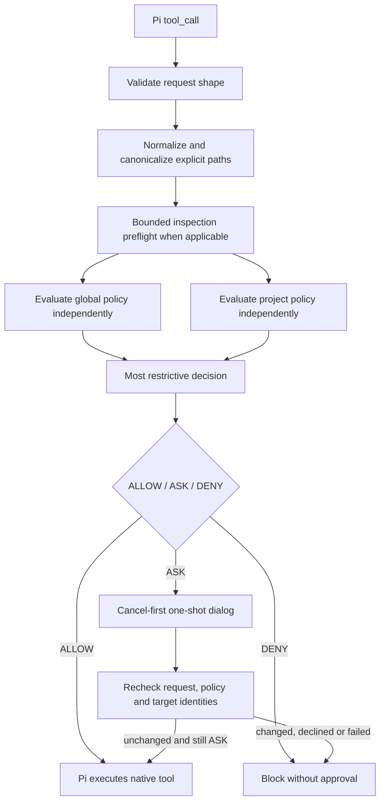

# Architecture

## Modules

| Module | Responsibility |
|---|---|
| `index.ts` | Public Pi hooks, session snapshots, serialized approvals, revalidation, receipts and optional diagnostic sink |
| `config.ts` | Strict JSON validation, scope anchoring, canonical policy loading and deep freezing |
| `requests.ts` | Validate native tool argument shapes and describe required operations |
| `paths.ts` | Lexical/canonical identities, component-aware containment, prospective writes and readable-file checks |
| `policy.ts` | Pure restriction evaluation and max composition |
| `bash.ts` | Bounded literal tokenization, ordinary/consequential classification |
| `inspection.ts` | Target/subtree read-policy preflight for recognized Bash inspection |

The host API surface is `session_start`, `session_shutdown`, `tool_call`,
`tool_result`, `turn_end`, `ui.select` and `ui.setStatus`. Runtime imports are
Node standard-library and relative modules; Pi types are erased. No tool is
replaced, no argument rewritten and no active-tool list reconstructed.

## Authority

Destructively merging a project object over a global object could replace DENY
with ALLOW. Instead each layer yields a decision and reasons; their maximum wins.
The same order applies to tool, scope, protected and command restrictions within
a layer. Guarded adds ASK for native writes/edits. Trusted contributes no extra
restriction and cannot remove an explicit global ASK or DENY.

An absent project policy is neutral. A present malformed/inaccessible policy is
not absent: loading leaves the gate blocking. Policy files, the extension source
and recognized aliases to them are protected against explicit native mutation.
A policy-file identity/revision change blocks subsequent calls until a new
snapshot. This is not filesystem immutability against arbitrary host programs.

## State and approvals

Runtime state consists of a frozen snapshot, session epoch, pending approval
queue, abort signal and short-lived receipt map. No persistent approval database,
hot reload, model routing, network service or telemetry is implemented. Diagnostic
callbacks are off by default and omit payloads and command strings.

Only ASK reaches the TUI. The selected response must be exactly `Allow once`.
The request digest, session epoch, policy identities and complete action are
checked again. The result must still be ASK and unchanged. Receipts are consumed
by tool-call ID and cleared at turn/session boundaries; they carry no authority.

## Initialization boundary

A successfully imported module installs its hooks even if its policy cannot
load. Every tool call then blocks. Pi can also continue after a *module import*
error, in which case no gate exists. Startup resource display and a synthetic
protected-read check distinguish these cases. The package does not supply a
mandatory launcher or attempt to enforce its own installation.
