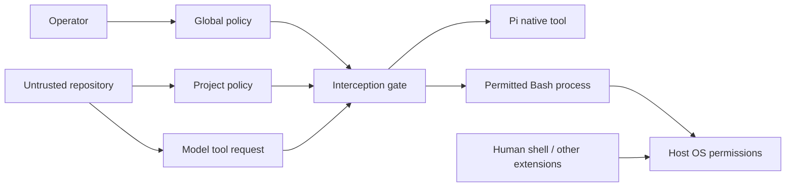

# Threat model

## Assets and assumptions

The assets are authoritative policy, explicit native-tool targets, approval scope
and the integrity of decisions made before Pi executes a model-requested tool.
The operator controls the global policy, package source and selected Pi instance.
Those files should be immutable or outside repository-controlled storage. Pi,
Node, the operating system, the UI and installed executables are trusted to do
what their APIs say. There is no protection if the operator disables the gate.

A hostile repository can influence model text and contain paths, symlinks, project
policy, scripts and executable configuration. Model tool arguments and project
policy are untrusted. Project configuration may tighten, never relax, the global
result. Profiles are global-only and snapshots do not automatically reload.

## Attacks within the checked boundary

| Surface | Check | Remaining limit |
|---|---|---|
| Protected target through symlink/chained alias | `realpath`, lexical/canonical selectors, scope checks | Check/execute races; not all hard links |
| Symlinked parent of new write | Canonical nearest existing parent plus prospective children | Parent may change after checking |
| Wider project roots or weaker project rules | Independent layer evaluation, maximum decision | Operator can deliberately change global policy |
| Malformed/duplicate-key policy | Strict validation, blocking loaded state | Module-load failure is different |
| Model requests hidden/custom tool | Unsupported-tool block; no tool visibility reconstruction | Other extensions may run directly |
| DENY approval request | DENY branch has no confirmation UI | Human can edit authoritative policy outside the gate |
| Approval reuse or changed target | One-shot revalidation, no persisted grants | Residual race after last check |
| Consequential literal Git operation | Explicit categories and max restrictions | Executable/config/hook identity is not attested |

Protected component selectors apply to reads as well as writes. Exact existing
file selectors also compare device/inode identities. This does not discover all
hard links to a component-protected file. Scope checks are deliberately stricter
than canonical containment alone: both lexical and canonical identities must be
inside an allowed root. A benign external alias can be rejected.

On Darwin, component comparisons normalize NFC and case-fold conservatively,
including on case-sensitive volumes. Do not extrapolate macOS evidence to all
filesystems. Races can change a target between policy evaluation, approval
revalidation and native execution. The extension does not hold kernel-enforced
capabilities or descriptors that eliminate those races.

## Process and resource boundary

An allowed `npm test`, interpreter, build, Git helper or arbitrary approved
command can execute repository-controlled code with host filesystem and network
permissions. Protected *native* reads do not imply `.env` secrecy from such code.
PATH, executable substitution, shell startup, program configuration, package
scripts, Git hooks/helpers and environment variables are not authenticated.

The bounded ls/rg preflight checks the paths understood by its literal recognizer.
It does not attest the eventual executable or its configuration, and its traversal
is not atomic with execution. File-name listing is not content-read containment.
Unknown simple commands can be allowed once according to policy; this is an
operator acceptance of process risk, not an analysis of their descendants.

Pi context/skill loading, Pi's own session/auth writes, human `!`/`!!` input and
other extensions' direct execution are outside the gate. Native Pi sessions may
record sensitive tool arguments/results; the extension does not redact them.
There is no OS sandbox, network destination policy, exfiltration prevention,
malicious-extension isolation or subagent containment.

## Operational failure

A policy evaluation error blocks while the gate exists. A missing/broken module
cannot enforce. Check the resource list, footer and synthetic protected-read
result before relying on a session. Do not use a model's assurance alone. A process
with sufficient OS permission can modify mutable global policy or bypass the
entire harness. Keep the operator trust boundary explicit.
