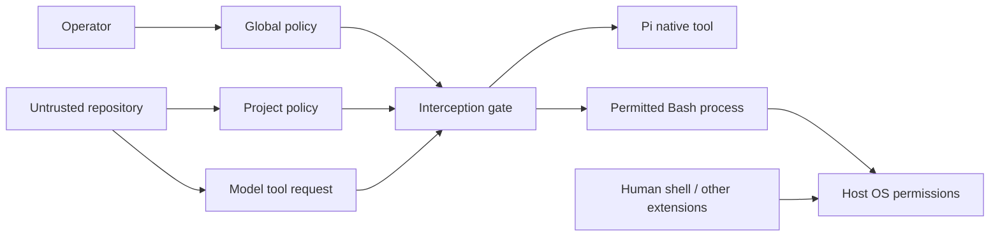

# Threat model

## Assets and assumptions

The assets are authoritative policy, explicit native-tool targets, session history, operator mode and grant scope
and the integrity of decisions made before Pi executes a model-requested tool.
The operator controls the global policy, package source and selected Pi instance.
Those files should be immutable or outside repository-controlled storage. Pi,
Node, the operating system, the UI and installed executables are trusted to do
what their APIs say. There is no protection if the operator disables the gate.

A hostile repository can influence model text and contain paths, symlinks, project
policy, scripts and executable configuration. Model tool arguments and project
policy are untrusted. Project configuration may tighten, never relax, the global
result. Mode is selected at operator startup (or defaults from global policy); project policy
cannot select mode. Snapshots do not automatically reload.

## Attacks within the checked boundary

| Surface | Check | Remaining limit |
|---|---|---|
| Protected target through symlink/chained alias | `realpath`, lexical/canonical selectors, scope checks | Check/execute races; not all hard links |
| Symlinked parent of new write | Canonical nearest existing parent plus prospective children | Parent may change after checking |
| Wider project roots or weaker project rules | Independent layer evaluation, maximum decision | Operator can deliberately change global policy |
| Malformed/duplicate-key policy | Strict validation, blocking loaded state | Module-load failure is different |
| Model requests custom tool | Reviewed adapter or conservative unknown fallback | Installation trust and in-process extension code are separate |
| DENY approval request | DENY branch has no confirmation UI | Human can edit authoritative policy outside the gate |
| Approval reuse or changed target | One-shot revalidation; operation/context/contract-scoped custom grants | Residual race; stale imported semantics |
| Consequential literal Git operation | Explicit categories and max restrictions | Executable/config/hook identity is not attested |

Protected component selectors apply to reads as well as writes. Exact existing
file selectors also compare device/inode identities. This does not discover all
hard links to a component-protected file. Scope checks are deliberately stricter
than canonical containment alone: both lexical and canonical identities must be
inside an allowed root. A benign external alias can be rejected.

On Darwin, component comparisons normalize NFC and case-fold conservatively,
including on case-sensitive volumes. Do not extrapolate macOS evidence to all
filesystems. Races can change a target between policy evaluation, approval
revalidation and native execution. The extension does not hold kernel-enforced
capabilities or descriptors that eliminate those races.

## Classification-control threats

Schema V2 treats the workstation operator and their Nix-owned global policy and
launcher configuration as trusted classification authorities. Repository content,
project policy, prompts, model tool calls, and child runtime commands are not.
The global policy alone owns canonical project-baseline entries. A repository
therefore cannot register itself PUBLIC or lower its session classification;
project-local resources and minimums only add restrictions.

Resource rules resolve both lexical and canonical identities, so a symlink or
canonical alias cannot select a different project/resource classification. A model
has no classification-mutation tool or runtime command, and a statement such as
"this is PUBLIC" is not an authority input. Once a PRIVATE label is stored or
admitted, a PUBLIC wrapper cannot lower it on resume. A distinct `--no-session`
operator launch is required for independent PUBLIC work.

`PI_MONOTONIC_PERMISSIONS_SESSION_CLASSIFICATION` is a trusted launch contract,
not a provenance measurement. PMP can validate its case-sensitive value and
capture it once, but cannot prove who constructed an arbitrary host process
environment. A Nix-owned launcher/executor must set it only for an operator's
fresh selection. Child context uses the separate inherited-context variable and
only raises a child. Opaque Bash and extension operations remain operation-level
classified because target attribution would not make their host access safe.

## Process and resource boundary

An allowed `npm test`, interpreter, build, Git helper or arbitrary approved
command can execute repository-controlled code with host filesystem and network
permissions. Protected *native* reads do not imply `.env` secrecy from such code.
PATH, executable substitution, shell startup, program configuration, package
scripts, Git hooks/helpers and environment variables are not authenticated.

The bounded ls/rg preflight checks the paths understood by its literal recognizer.
It does not attest the eventual executable or its configuration, and its traversal
is not atomic with execution. File-name listing is not content-read containment.
Unknown simple commands can be allowed once according to policy; this is an
operator acceptance of process risk, not an analysis of their descendants.

Pi context/skill loading, Pi's own session/auth writes, human `!`/`!!` input and
other extensions' direct execution are outside the gate. Native Pi sessions may
record sensitive tool arguments/results; the extension does not redact them.
There is no OS sandbox, network destination policy, exfiltration prevention,
malicious-extension isolation or subagent containment.

## Operational failure

A policy evaluation error blocks while the gate exists. A missing/broken module
cannot enforce. Check the resource list, footer and synthetic protected-read
result before relying on a session. Do not use a model's assurance alone. A process
with sufficient OS permission can modify mutable global policy or bypass the
entire harness. Keep the operator trust boundary explicit.

## Custom-tool and grant threats

An installed extension is trusted executable code. A model-requested invocation
of its tool is separately governed. A reviewed adapter may misclassify broader
semantics, and an unknown or evolving schema may invalidate prior assumptions.
The recall registry recognizes the reviewed schema and validates arguments; a
changed schema receives conservative unknown treatment and retains configured
recall restrictions. No name/schema match proves package authenticity.

Operator grants resolve ASK friction. They never alter authoritative policy and
never override DENY. Unknown tools cannot receive persistent grants and their
session scope is exact arguments. Reviewed recall grants use distinct active/all
lineage classes. Context and contract fingerprints prevent the tested stale-key
cases; a changed imported module behind an unchanged entry/schema/source label
is not reliably detected. Package review, exact pins and manual revocation are
required when semantics change. Runtime configuration and remote resources are
also not attested. A malicious extension could bypass all of this directly.

Grant storage is owner-only mutable user state outside immutable policy. Native
explicit writes to the state directory and canonical aliases are blocked. Host
programs running with user privileges can still edit it. Atomic replacement
avoids partial writes, but concurrent processes can lose a convenience update.
Deleting persistent grants does not erase an independently granted session scope;
restart when revoking both. There is no credential/result/history storage in grants.

## Recall and routing

The higher-authority release gate evaluates context and history against the
resolved environment before policy, grants or mode. `PUBLIC < INTERNAL <
PRIVATE < SECRET`; local trusted execution reaches `PRIVATE`, hosted defaults to
`PUBLIC`, and `SECRET` is never eligible for normal generative inference.
Projects can lower ceilings only. Missing declarations deny. This is an explicit
`mayReleaseContext` contract for a future router, not automatic routing or a DLP
system. Labels are declarations; 0.1.0 does not scan secrets or sanitize data.

Blackhole recall is an information-disclosure operation over session history.
Read-only does not mean risk-free. Protected native filesystem policy does not
redact information already recorded in history. `scope: "all"` includes other
branches in the same session; it is a separate ASK operation by default. The
active-lineage adapter blocks empty/failed branch identity to avoid the pinned
Blackhole fallback to all entries. Working Pi session APIs are a precondition;
malicious in-process replacement and post-check races are outside containment.

Deterministic compaction can omit instruction text as well as source details.
Recall permits evidence recovery but does not guarantee a model will detect every
omission. Manual review remains necessary for the evaluated integration.

A future hosted model could receive history created under a local/private routing
assumption. History is subject to the release gate and is not automatically
eligible after a route change. 0.1.0 does not select routes or sanitize data; the
planned workstation run uses local oMLX and no automatic hosted fallback.

## YOLO

Startup-selected YOLO intentionally bypasses ordinary model-tool enforcement
after classification eligibility succeeds. Ordinary policy ASK friction is removed,
but malformed calls and classification denials remain blocked. Commands/tools run
with Pi and OS-user privileges; other host controls
still apply. The continuous `permissions: YOLO ⚠` footer makes the choice visible.
Unauthorized entry into YOLO is an in-scope defect, intentional operator selection
is not. No project field, model tool, skill, memory or runtime command selects it.
Approved arbitrary programs can launch other processes; this is not prevention of
independent Pi launches or containment of installed extension JavaScript.
